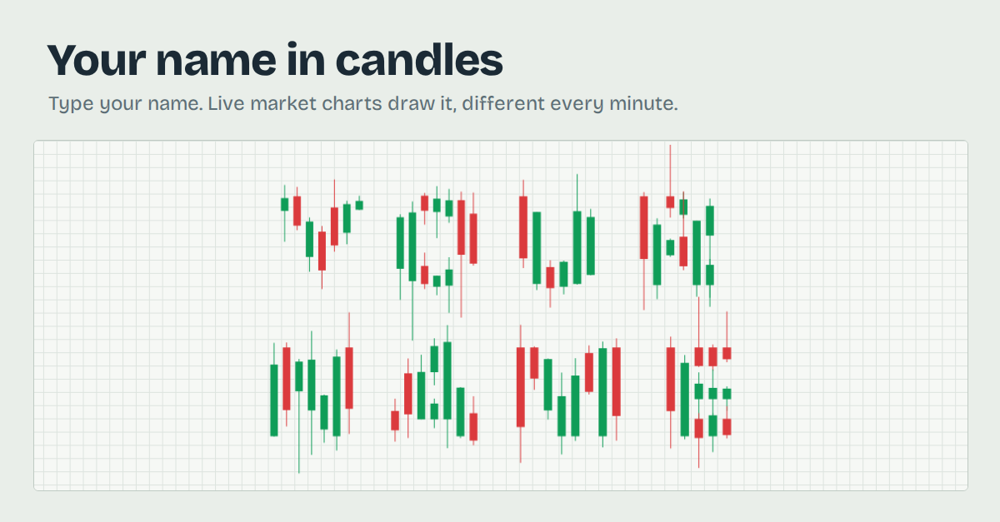

# Your name in candles

Type your name and watch it get drawn out of live crypto candlestick charts.

**Try it:** https://nameincandles.netlify.app

## How it works

- The page pulls the last few hours of 1-minute candles from about 60 Coinbase markets, and rescans every minute.
- Each letter is built from one market's real chart. Reading the letter left to right walks forward in time through that chart.
- Each candle drops into the next spot of the letter it roughly fits. Candles are never resized, so stems are uneven and edges are ragged.
- Every letter uses a different market, so the same name looks different every time the market moves.
- Optional: paste a free Twelve Data key on the page to add US stocks to the scan.

## Files

- `index.html` is the whole app: one page, no build step.
- `_redirects` tells Netlify to fetch Coinbase data on the page's behalf, so no browser blocks it.
- `preview.png` is the image LinkedIn and other sites show when the link is shared.

Built by Shreyas Mahishkar. [LinkedIn](https://www.linkedin.com/in/shreyas-mahishkar)
